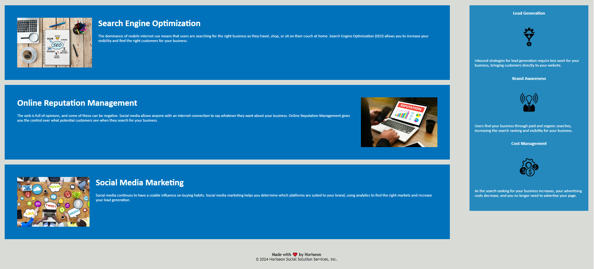

# code-refactor
Week 1 Challenge

## Description

The purpose of this project was to refactor a source code to meet modern day accesibility requirements using semantic HTML elements and associated CSS styles. I created this project to apply the lessons of the first week of classes in a toned down real-world scenario with low risk, allowing me to freely alter the code and make mistakes to learn the best practises for optimization. This project has made me more confident in the usage and implementation of both semantic and non-semantic HTML elements as well as various CSS selectors and their associated modifiers. Through this project I have learned the ways in which a websites code can be redundant and/or unnecessary, along with various ways of restructuring or removing that code, whether in HTML or CSS, in order to create a more streamlined viewing experience. 

## Table of Contents

If your README is long, add a table of contents to make it easy for users to find what they need.

- [Original Code](#original-code)
- [Code Source](#code-source-within-this-repo)
- [Usage](#usage)
- [Credits](#credits)
- [License](#license)

## Original Code

The original, unedited code for this project can be found [HERE](https://git.bootcampcontent.com/University-of-Richmond/UR-VIRT-FSF-PT-02-2024-U-LOLC/-/tree/main/01-HTML-Git-CSS/02-Challenge?ref_type=heads)

## Code Source Within This Repo

The HTML code within this repo can be found at [./index.html](index.html)

The CSS Style sheet can be found at [./assets/css/style.css](./assets/css/style.css)

## Usage

The live deployment of this project can be found at [https://h-lane.github.io/code-refactor/](https://h-lane.github.io/code-refactor/)

## Credits

 - University of Richmond Coding Bootcamp
 - README Template provided by [The Coding Bootcamp Github](https://coding-boot-camp.github.io/full-stack/github/professional-readme-guide)
 - HTML Assistance provided by [The Coding Bootcamp Github](https://coding-boot-camp.github.io/full-stack/html/html-cheatsheet)
- Markdown Syntax assistance provided by [Github Docs](https://docs.github.com/en/get-started/writing-on-github/getting-started-with-writing-and-formatting-on-github/basic-writing-and-formatting-syntax#section-links)

## License
This project has no license and is openly available.